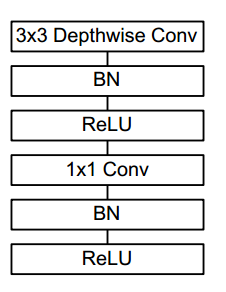
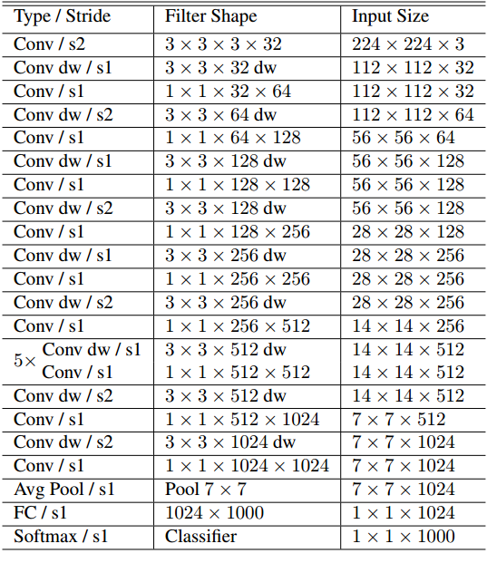
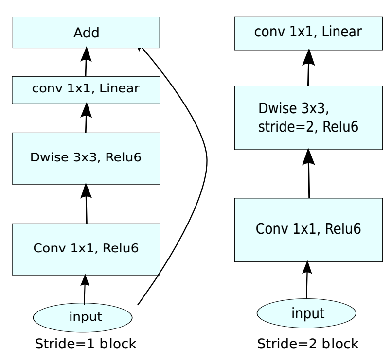
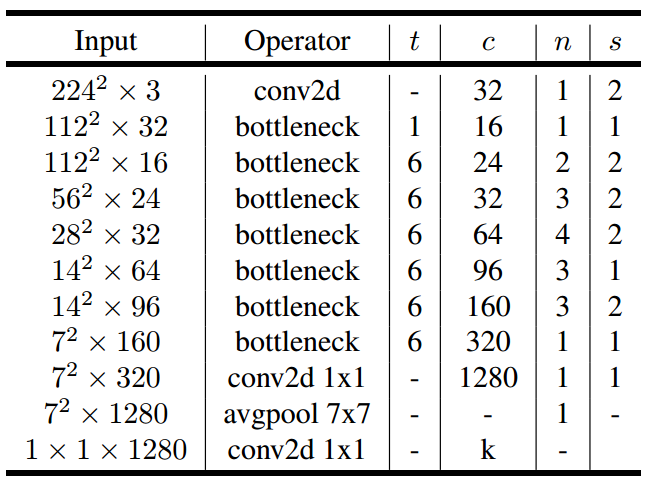

# MobileNet v1/v2
A Python 3 and tensorflow 2.0 implementation of MobileNet V1 and V2.

## Requirement
* TensorFlow 2
* matplotlib==3.0.3
* numpy==1.16.2
* scipy==1.2.1
* Pillow==6.2.0
* graphviz==0.10.1

** tips: you can install tf2 by https://github.com/ageron/tf2_course**

## MobileNet v1 and V2 architectures
### MobileNet v1
##### Depthwise Separable Convolution

##### MobileNet v1 Body Architecture

### MobileNet v2
##### Inverted residuals with Linear Bottlenecks

##### MobileNet v2 Body Architecture

## reference
MobileNets: Efficient Convolutional Neural Networks for Mobile Vision Applications
MobileNetV2: Inverted Residuals and Linear Bottlenecks
https://github.com/Zehaos/MobileNet/blob/master/nets/mobilenet.py
https://github.com/xiaochus/MobileNetV2/blob/master/mobilenet_v2.py

